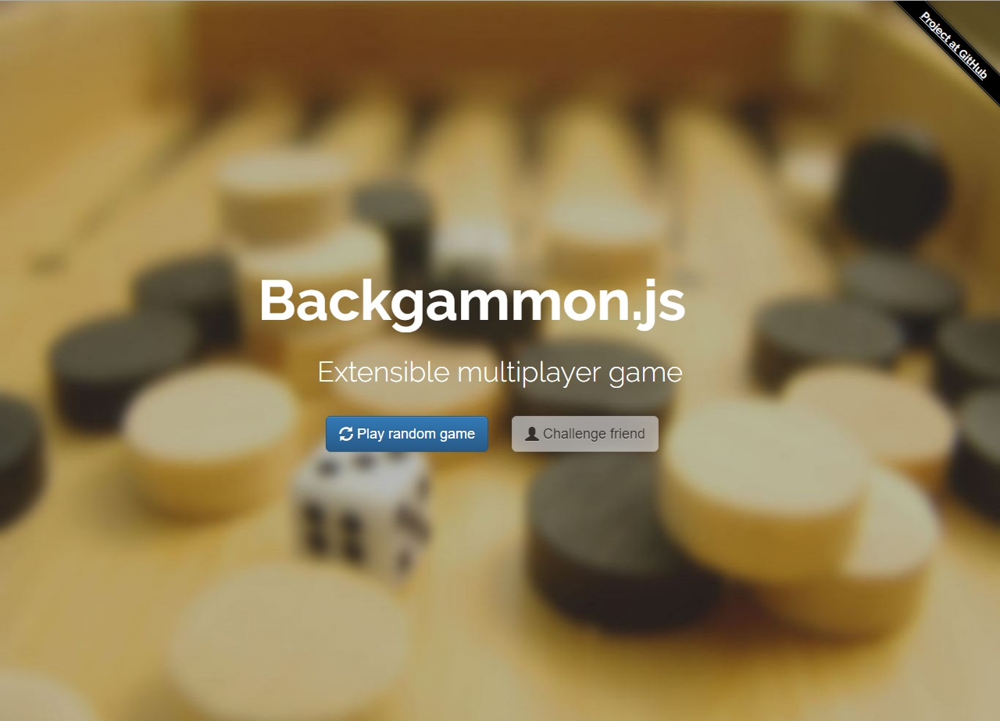
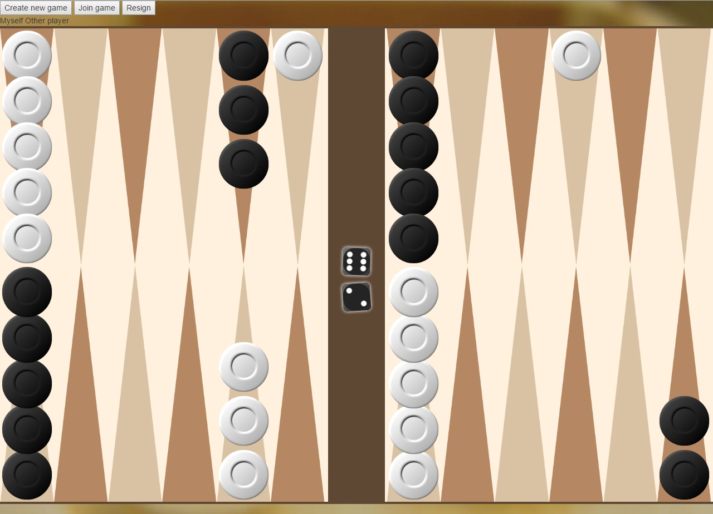
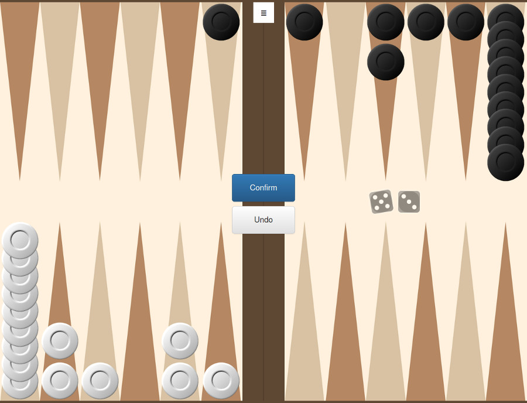

# backgammon.js 

### Extensible multiplayer backgammon game written in JavaScript

Current version: 0.6

See [CHANGELOG](CHANGELOG.md) for recent changes.

**Volunteer needed to host the DEMO.**

## Features:

- Challenge friends or play with strangers online without registration and game setup process.
- Fair gameplay that is as close to real game as possible:
    - no visual hints (eg. for allowed moves);
    - no pip counter;
    - quality random generator.
- Extensible and modular engine that would allow the open source community to implement different variants of the game as known in different countries and different user interfaces (eg. themes).
- Lightweight - playable on any device, even old ones - anything that can run a modern browser;
- Works in browser @ PC & Mobile;

If you want to learn more about the project see [Detailed documentation](docs/README.md).

## Demo

[Playable DEMO of backgammon.js](https://backgammonjs.herokuapp.com/)

The demo is using the [free tier of Heroku](https://www.heroku.com/).

You are free to host the game at your own server.

## How to install

To host the game on your own server or test it locally for development, you need to install the main backgammon.js package.
It includes both the backgammon.js server and client.

There is no need to install the client separately, as it is served automatically from the server via HTTP.
Client should work in *modern* browsers of both desktop PCs and mobile devices.

The universal way to install the server is:

1. Clone repository locally
2. Change working directory to the local copy of the repository
3. Run:

        npm install
        npm start

The game server has been tested to work on the following platforms:

- [Ubuntu](docs/INSTALL.md#ubuntu)
- [Windows](docs/INSTALL.md#windows)
- [Docker](docs/INSTALL.md#docker)
- [Heroku](docs/INSTALL.md#heroku)
- [OpenShift Online](docs/INSTALL.md#openshift-online)

Follow the links above for more detailed installation instructions on those platforms.

## How to change default rule

Currently three rules have been implemented (as known in Bulgaria):
 
- [`RuleBgCasual`](lib/rules/RuleBgCasual.js) - Standard rules, but without doubling cube (Rules: [Standard/Обикновена](https://en.wikipedia.org/wiki/Backgammon#Rules))
- [`RuleBgGulbara`](lib/rules/RuleBgGulbara.js) - `Gul bara`, also called `Rosespring` or `Crazy Narde` (Rules: [Gul bara/Гюлбара](https://en.wikipedia.org/wiki/Gul_bara))
- [`RuleBgTapa`](lib/rules/RuleBgTapa.js) - `Tapa` (Rules: [Tapa/Тапа](https://en.wikipedia.org/wiki/Tapa_(game)))

The player can choose which rule to play before starting a new game.

## How to add new rules (variants)

Short instructions on how to add new rules are available here: [Creating rules for `backgammon.js`](docs/rules.md).

## Documentation:

- [Installation instructions](docs/INSTALL.md)
- [Detailed documentation](docs/README.md)
- [JsDoc documentation of library](https://cdn.rawgit.com/quasoft/backgammonjs/master/docs/backgammon.js-lib/0.0.1/index.html)

## Screenshots
### Classic rule:

### Gul bara rule:

