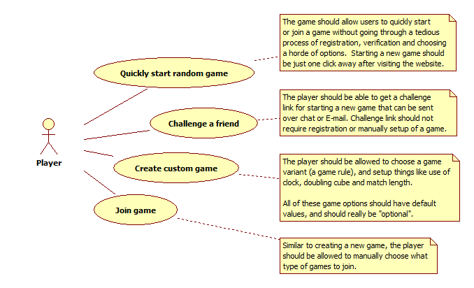
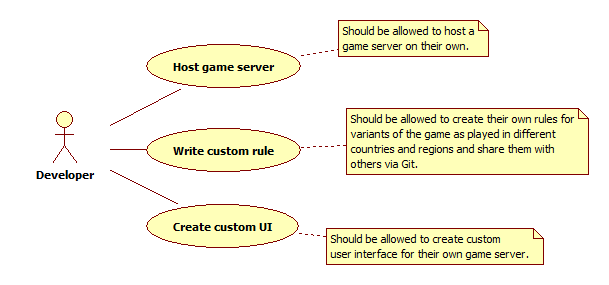
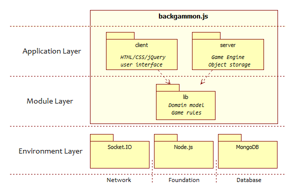
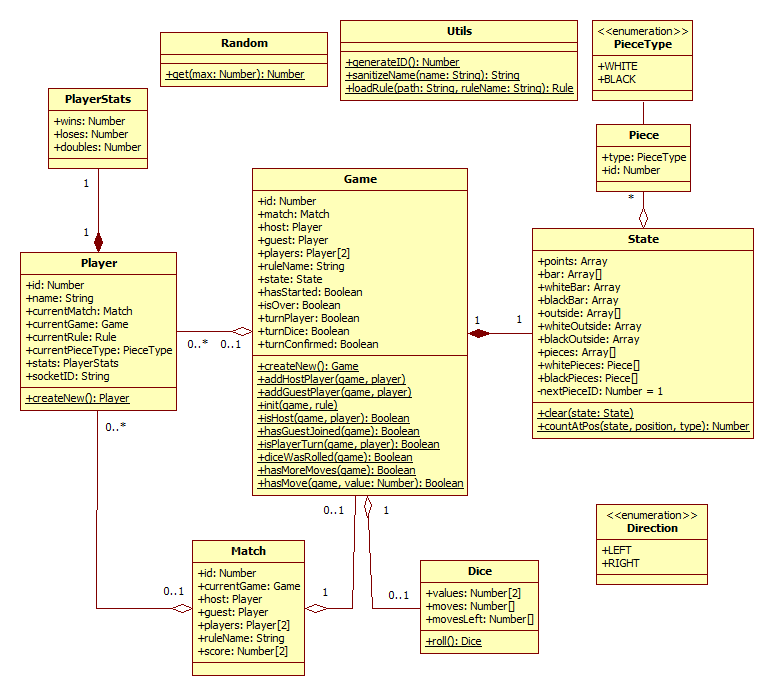
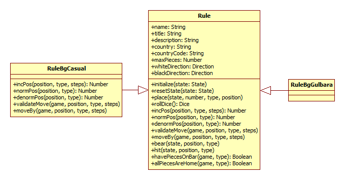

# [backgammon.js](../README.md) :: Detailed documentation

## Contents:

1. [Motivation/problem](#motivationproblem)
2. [Goals](#goals)
   - [Must have](#must-have)
   - [Under consideration](#under-consideration)
3. [Users/Actors](#usersactors)
4. [Use cases](#use-cases)
   - [Player's use cases](Players-use-cases)
   - [Developer's use cases](Developers-use-cases)
5. [Objectives](#objectives)
   - [High level](#high-level)
   - [Mid-level](#mid-level)
6. [Roadmap](#roadmap)
7. [Architecture](#architecture)
   - [Overview](#overview)
   - [Environment layer](#environment-layer)
   - [Module layer](#module-layer)
   - [Application layer](#application-layer)
   - [Directory structure](#directory-structure)
8. [Credits](#credits)
   - [Tools used](#tools-used)
   - [Frameworks used](#frameworks-used)
9. [License](#license)

## Motivation/problem

Backgammon is one of the most popular and ancient board games and there are zillion implementations of it for PC and mobile crafted around the world.

Alas, most implementations share some of the following shortcomings:

- Not suitable for a quick game

  They require registration, verification by E-mail, manually creating a game and setting up game options before starting the game.

- Helping players too much

  Most implementations are providing too much help to players, like highlighting movable pieces, pipe counters, and even move hints.

  As a result the experience of playing the game suffers. What's more that prevents junior players from actually learning to play.

- Based on specific culture

  Most implementations only allow playing a single variant of backgammon (or at best a few). This is an ancient game with many variants being played in different countries on even in different regions in the same country.

- Require more processing power to run

  Some implementations have too high hardware requirements for a board game, which makes playing them on an old PC unpleasant.

- Not mobile friendly

  Could not be played on tablet or mobile phone.

## Goals:

The purpose of this project is to create an online backgammon game that has none of these shortcoming. This should be achieved by meeting the project goals.

Goals have been divided in two categories: "must have" and "under consideration".

Once a goal makes it to the "must have" list, objectives can be assigned to it.

### Must have:

This is the list of must-have goals, that should be available in first stable release:

- Allow anyone to challenge friends or play with strangers online with zero time to start the game - requires no registration or configuration.
- Fair gameplay that is as close to real game as possible:
    - no visual hints for moves allowed;
    - no pip counter;
    - quality random generator.
- Extensible and modular engine that would allow the open source community to implement different variants of the game as known in different countries and different user interfaces (eg. themes).
- Lightweight - playable on any device, even old ones - anything that can run a modern browser;
- Works in browser @ PC & Mobile;

### Under consideration:

This is a set of optional goals that might or might not be considered as long-term goals for the future:

- Add multiple language support.
- Allow optional registration;
- Remember game history;
- Support player ratings;
- Create replay engine;

## Users/Actors

There will be two main types of users of the system:
- **Players** - Players will just play the game
- **Developers** - Developers will host the game at servers and write custom rules

## Use cases

Use cases for those actors complement the goals from users' perspective:

### Player's use cases:



*Create custom game and Join game are not fully implemented yet.*

### Developer's use cases:



## Objectives

### High level:

These are business objectives that exactly match goals.

> Allow anyone to challenge friends or play with strangers online with zero time to start the game - requires no registration or configuration

- [X] Allow players to quickly start a random game;
- [X] Allow players to send invites by chat or E-mail;

-----

> Fair gameplay that is as close to real game as possible

- [X] Use quality random generator

-----

> Extensible and modular engine that would allow the open source community to implement different variants of the game as known in different countries and different user interfaces (eg. themes)

- [X] Allow writing custom rules
- [ ] Allow writing custom UI

-----

> Lightweight - playable on any device, even old ones - anything that can run a modern browser
> Works in browser @ PC & Mobile

- [X] Make a lightweight client that works in both desktop and mobile browsers alike

### Mid-level:

Coming soon...

## Roadmap

| Objective                                   | State                                | Time Frame |
|:--------------------------------------------|:-------------------------------------|:----------:|
| Create documentation                        | :soon: In Progress                   |            |
| Choose network/communication library        | :white_check_mark: Completed         |            |
| Choose DBMS                                 | :white_check_mark: Completed         |            |
| Create object model                         | :soon: Working                       |            |
| Create a sample rule                        | :construction: In Progress           |            |
| Create simple board UI                      | :construction: In Progress           |            |
| Integrate Socket.IO                         | :soon: Working                       |            |
| Allow player to create and join game        | :construction: In Progress           |            |
| Allow player to start game                  | :soon: Working                       |            |
| Allow player to start random game           | :soon: Working                       |            |
| Update board UI on game state change        | :construction: In Progress           |            |
| Allow player to roll dice (at server)       | :white_check_mark: Completed         |            |
| Use quality random generator                | :white_check_mark: Completed         |            |
| Always show player's pieces at bottom       | :white_check_mark: Completed         |            |
| Play lowest die value on right click        | :white_check_mark: Completed         |            |
| Reverse die values on click at dice         | :white_check_mark: Completed         |            |
| Allow player to move pieces                 | :white_check_mark: Completed         |            |
| Validate moves at server, using rules       | :white_check_mark: Completed         |            |
| Allow player to end turn, if a move cannot be played | :white_check_mark: Completed |            |
| Force player to use all possible moves, if possible | :white_check_mark: Completed |            |
| Continue game on page reload                | :soon: Working                       |            |
| Implement matches                           | :soon: Working                       |            |
| Show an offcanvas game menu                 | :soon: Working                       |            |
| Show player names and match score in toolbar| :construction: In Progress           |            |
| Show borne pieces                           | :white_large_square: Not implemented |            |
| Allow player to resign from game/match      | :white_check_mark: Completed         |            |
| Allow user to get "challenge" links         | :white_check_mark: Completed         |            |
| Allow user to see list of games             | :white_large_square: Not implemented |            |
| Users can filter/sort games by rule         | :white_large_square: Not implemented |            |
| Users can choose use of clock, cube and match length | :white_large_square: Not implemented |            |
| Polish simple board UI                      | :white_large_square: Not implemented |            |
| Allow user to choose game rule (variant)    | :white_check_mark: Completed         |            |
| End match if connection is broken for X mins| :white_check_mark: Not implemented   |    Next    |


*Possible states: :white_large_square: Not implemented, :construction: In progress, :soon: Working, :white_check_mark: Completed*

## Architecture

### Overview

The project uses a typical client/server architecture with several layers of responsibility.



### Environment layer

The environment layer contains external systems and frameworks the project depends on, like `Node.js` and `Socket.IO`.

Foundation of project is laid on `node.js`. Network connectivity is implemented via `Socket.IO`. Storage of objects will be performed by `MongoDB`, but database layer has not been integrated yet, so everything is reset when the server application is restarted. Database will be required if we decide to allow players to register and save their game history.

### Module layer

The module layer contains classes shared between client and server all packaged in a single `node.js` package named `backgammon.js-lib`.

This package includes:
- Classes describing domain model;
- Messages exchanged on network layer;
- Rules for variants of the game.

`JsDoc` documentation of library classes is available at [Library Reference](https://cdn.rawgit.com/quasoft/backgammonjs/master/docs/backgammon.js-lib/0.0.1/index.html).

#### Model classes:



#### Rule classes:



Instructions on adding new variants of backgammon (rules) to the game can be found at [Creating rules for `backgammon.js`](rules.md).

### Application layer

The application layer consists of two `node.js` packages: `backgammon.js-client` and `backgammon.js-server`.

Both packages depend on the common library modules and use `Socket.IO` to communicate with each other.

### Directory structure

Directory structure of code follows project architecture:
```
├─ [app]                - Place for applications' code (server, browser, android, etc.)
│  ├─ [browser]         - Sample web client application
│  │  ├─ [images]       
│  │  ├─ [js]
│  │  │  ├─ bundle.js   - browserify's output file (bundling all other scripts)
│  │  │  ├─ config.js   - Config script for client
│  │  │  ├─ main.js     - Main script file for index.html
│  │  │  └─ SimpleBoardUI.js - Sample user interface for game board
│  │  │─ [style]
│  │  │  └─ backgammon.css   - Main style file for index.html
│  │  ├─ bower.json     - Bower package file for web client
│  │  ├─ index.html     - Home page of web client
│  │  ├─ package.json   - Node.js package file
│  │  └─ README.md      - Instructions for client installation and development
│  │
│  └─ [server]          - Server application
│     ├─ package.json   - Node.js package file
│     ├─ queue_manager.js - Node.js package file
│     ├─ README.md      - Instructions for server installation and development
│     └─ server.js      - Server startup script
│  
├─ [docs]
│  ├─ [images]
│  ├─ backgammon.js.uml
│  ├─ INSTALL.md		- Detailed installation instructions
│  ├─ README.md			- This file
│  ├─ rules.md			- Instructions on creating a new rule
│  └─ use-cases.md
│
├─ [lib]                - Common library shared by clients and server
│  ├─ [rules]           - Rules describing different variants of the game
│  │  ├─ rules\rule.js  - Base class for defining game rules
│  │  ├─ rules\RuleBgCasual.js - Rule for most popular variant
│  │  ├─ rules\RuleBgGulbara.js - Example for `Gul bara` variant
│  │  └─ rules\RuleBgTapa.js - Example for `Tapa` variant
│  ├─ client.js         - Messages exchanged on network layer
│  ├─ comm.js           - Messages exchanged on network layer
│  ├─ model.js          - Classes of the object oriented model
│  ├─ package.json      - Node.js package file
│  └─ README.md         - Library documentation and instructions on writing new rules
│
├─ .gitignore
├─ .tern-project        - Sample configuration for atom-tern.js plugin
├─ CHANGELOG.md
├─ Dockerfile
├─ LICENSE              - MIT License
├─ package.json         - Main project package
└─ README.md            - Project's readme with links to all documents
```

## Credits

- Heroku - free tier of service used for running the demo

### Tools used:

- Brackets & Atom editor (with `atom-tern.js`)
- Netbeans IDE
- White StarUML
- browserify.js
- watch.js
- watchify.js
- JsDoc
- Git
- Paint.NET

### Frameworks and libraries used:

- Node.js
- Express
- Socket.IO
- jQuery
- Bootstrap
- OhSnap!.js
- Fittext.js
- clipboard.js
- js-cookie

## License

Licensed under the [MIT license](../LICENSE).

## Other documents:

- [`Project README`](../README.md)
- Client application: [`backgammon.js-client`](../app/browser/README.md)
- Server application: [`backgammon.js-server`](../app/server/README.md)
- Common Library: [`backgammon.js-lib`](../lib/README.md)
